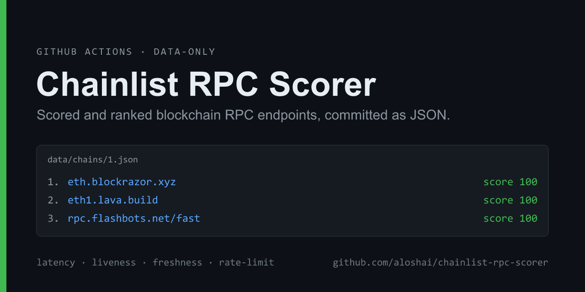
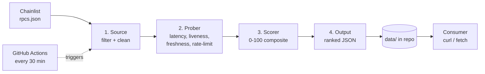

<div align="center">



# Chainlist RPC Scorer

Scored and ranked blockchain RPC endpoints, generated by GitHub Actions and committed as JSON.

[](https://github.com/aloshai/chainlist-rpc-scorer/actions/workflows/probe.yml)
[](https://github.com/aloshai/chainlist-rpc-scorer/commits/main)


</div>

A GitHub Action probes every RPC listed on [Chainlist](https://chainlist.org), measures latency, liveness, block freshness, and rate-limit tolerance for each endpoint, and commits a ranked list into this repository as JSON.

## Quick start

Fetch the highest-scoring Ethereum RPC:

```bash
curl -s https://raw.githubusercontent.com/aloshai/chainlist-rpc-scorer/main/data/chains/1.json \
  | jq -r '.rpcs[0].url'
```

```
https://eth.blockrazor.xyz
```

The output is a static file in the repository, regenerated roughly every 30 minutes. Chain summaries are in [`data/index.json`](data/index.json); each chain's full ranking is at `data/chains/<chainId>.json`.

## How it works



Each run is an independent snapshot — every RPC is actively probed and scored from scratch, with no historical state carried over.

| Metric | Measurement | Why it matters |
|--------|-------------|----------------|
| **Liveness** | `eth_chainId` and `eth_blockNumber` succeed, and the returned chain ID matches the expected chain | Filters dead nodes and spoofed or wrong-chain endpoints. Failing this gate forces the score to `0`. |
| **Latency** | Repeated `eth_blockNumber` calls, reduced to median (p50) and p95 | A slow endpoint degrades application responsiveness. |
| **Freshness** | Returned block height versus the highest block seen across the chain's RPCs (`blockLag`) | A lagging node serves stale state. |
| **Rate limit** | A bounded burst test ramps concurrency until throttling appears (HTTP 429 / quota errors) | Indicates how much sustained load the endpoint tolerates. |

## Scoring

The composite score is a weighted sum of three sub-scores, each on a 0–100 scale:

```
score = 0.40 · latency  +  0.30 · freshness  +  0.30 · rateLimit
```

Liveness acts as a gate: dead or wrong-chain endpoints are scored `0` and sink to the bottom of the ranking. All weights and thresholds are defined in [`src/config.ts`](src/config.ts).

## Data format

`data/chains/1.json` — endpoints sorted best-first:

```json
{
  "chainId": 1,
  "name": "Ethereum Mainnet",
  "updatedAt": "2026-06-03T09:41:27.598Z",
  "rpcs": [
    {
      "url": "https://eth.blockrazor.xyz",
      "tracking": "none",
      "score": 100,
      "alive": true,
      "latencyMs": { "p50": 19, "p95": 19 },
      "blockLag": 0,
      "rateLimit": { "sustainableRps": 40, "throttled": false },
      "subScores": { "latency": 100, "freshness": 100, "rateLimit": 100 },
      "errorKind": null
    }
  ]
}
```

`data/index.json` — one entry per monitored chain:

```json
{
  "updatedAt": "2026-06-03T09:41:27.598Z",
  "chains": [
    { "chainId": 1, "name": "Ethereum Mainnet", "rpcCount": 74, "aliveCount": 36, "file": "chains/1.json" }
  ]
}
```

## Monitored chains

**Mainnets**

| Chain | ID | Chain | ID |
|-------|----|-------|----|
| Ethereum | `1` | Base | `8453` |
| BNB Smart Chain | `56` | Avalanche C-Chain | `43114` |
| Polygon | `137` | Fantom | `250` |
| Arbitrum One | `42161` | Gnosis | `100` |
| OP Mainnet | `10` | Cronos | `25` |

**Testnets**

| Chain | ID | Chain | ID |
|-------|----|-------|----|
| Ethereum Sepolia | `11155111` | Base Sepolia | `84532` |
| Ethereum Holesky | `17000` | Avalanche Fuji | `43113` |
| BNB Smart Chain Testnet | `97` | Fantom Testnet | `4002` |
| Polygon Amoy | `80002` | Gnosis Chiado | `10200` |
| Arbitrum Sepolia | `421614` | Cronos Testnet | `338` |
| OP Sepolia | `11155420` | | |

To track another chain, add its ID to `chains` in [`src/config.ts`](src/config.ts); the next scheduled run picks it up automatically.

## Local usage

```bash
npm ci
npm run probe       # fetch, probe, score, and write data/
npm test            # unit tests (scorer, prober, source, output)
npm run typecheck   # tsc --noEmit
```

The same `npm run probe` command is what the GitHub Action executes.

## Project structure

```
chainlist-rpc-scorer/
├── src/
│   ├── config.ts     # chains, weights, probe and burst tunables
│   ├── source.ts     # 1. fetch + filter Chainlist
│   ├── prober.ts     # 2. probe one RPC -> ProbeResult
│   ├── scorer.ts     # 3. ProbeResult -> 0-100 score (pure)
│   ├── output.ts     # 4. ranked JSON writer
│   ├── index.ts      #    CLI orchestrator
│   └── types.ts
├── test/             # vitest specs and fixtures
├── data/             # generated and committed by the Action
└── .github/workflows/probe.yml
```

The core path (`source → prober → scorer`) is pure and side-effect-free, so the same code could later be wrapped by an HTTP service without modification.

## Limitations

Latency and rate-limit figures are measured from GitHub-hosted runners — a single network vantage point in an Azure datacenter. They are best read as a relative ranking rather than the absolute latency you would observe from your own location. Liveness and freshness are vantage-independent.

## License

[MIT](LICENSE)
