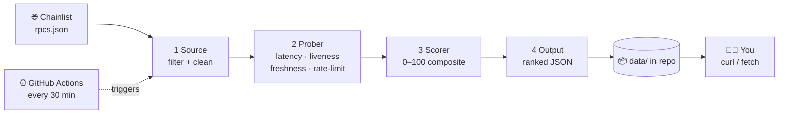

<div align="center">

# ⚡ Chainlist RPC Scorer

### Continuously scored & ranked blockchain RPC endpoints — no server, no database, just data.

[](https://github.com/aloshai/chainlist-rpc-scorer/actions/workflows/probe.yml)


*A GitHub Action probes every RPC on [Chainlist](https://chainlist.org), measures how fast, fresh, and rate‑limit‑tolerant each one is, then commits a ranked list straight into this repo. You just `curl` the JSON.*

</div>

---

## 🚀 Grab the best RPC in one line

```bash
# Fastest, healthiest Ethereum RPC right now 👇
curl -s https://raw.githubusercontent.com/aloshai/chainlist-rpc-scorer/main/data/chains/1.json | jq -r '.rpcs[0].url'
```

```
https://eth.blockrazor.xyz
```

That's it. No API key, no rate limit, no sign‑up. The list is just a file in this repo, refreshed every ~30 minutes.

> 📂 Browse all chains in [`data/index.json`](data/index.json) · each chain lives at `data/chains/<chainId>.json`

---

## 🧠 How it works



Every run is a **fresh snapshot** — each RPC is actively probed and scored from scratch:

| 🧪 Metric | What we measure | Why it matters |
|----------|-----------------|----------------|
| ❤️ **Liveness** | `eth_chainId` + `eth_blockNumber` succeed **and** the returned chain ID matches | Filters dead nodes and spoofed/wrong‑chain endpoints — fail this gate and your score is `0` |
| 🏎️ **Latency** | Repeated `eth_blockNumber` calls → median (p50) + p95 | A snappy RPC keeps your dApp responsive |
| 🧊 **Freshness** | Returned block vs. the highest block across the chain's RPCs → `blockLag` | A lagging node serves stale state |
| 🚦 **Rate limit** | Aggressive burst test ramps concurrency until throttled (HTTP 429 / quota) | Tells you how hard you can hammer it |

### 📐 The score

```
score = 0.40 · latency  +  0.30 · freshness  +  0.30 · rateLimit      (each sub‑score 0–100)
```

Dead or wrong‑chain endpoints are gated to **0** and sink to the bottom of the list. Weights and thresholds are all tunable in [`src/config.ts`](src/config.ts).

---

## 📦 What the data looks like

`data/chains/1.json` (top of the ranked list):

```json
{
  "chainId": 1,
  "name": "Ethereum Mainnet",
  "updatedAt": "2026-06-03T09:41:27.598Z",
  "rpcs": [
    {
      "url": "https://eth.blockrazor.xyz",
      "tracking": "none",
      "score": 100,
      "alive": true,
      "latencyMs": { "p50": 19, "p95": 19 },
      "blockLag": 0,
      "rateLimit": { "sustainableRps": 40, "throttled": false },
      "subScores": { "latency": 100, "freshness": 100, "rateLimit": 100 },
      "errorKind": null
    }
  ]
}
```

`data/index.json` summarizes every monitored chain:

```json
{
  "updatedAt": "2026-06-03T09:41:27.598Z",
  "chains": [
    { "chainId": 1, "name": "Ethereum Mainnet", "rpcCount": 74, "aliveCount": 36, "file": "chains/1.json" }
  ]
}
```

---

## 🔗 Monitored chains

| | Chain | ID | | Chain | ID |
|---|-------|----|---|-------|----|
| 🟣 | Ethereum | `1` | 🔵 | Base | `8453` |
| 🟡 | BNB Smart Chain | `56` | 🔺 | Avalanche C | `43114` |
| 🟪 | Polygon | `137` | 👻 | Fantom | `250` |
| 🔷 | Arbitrum One | `42161` | 🦉 | Gnosis | `100` |
| 🔴 | OP Mainnet | `10` | ⚫ | Cronos | `25` |

Want more? Add the chain ID to `chains` in [`src/config.ts`](src/config.ts) — the next run picks it up automatically.

---

## 🛠️ Run it yourself

```bash
npm ci
npm run probe       # fetch → probe → score → write data/
npm test            # 24 unit tests (scorer, prober, source, output)
npm run typecheck   # tsc --noEmit
```

No `.env`, no services to spin up. The same `npm run probe` is what the GitHub Action runs.

---

## 🗂️ Project structure

```
chainlist-rpc-scorer/
├── src/
│   ├── config.ts     # chains, weights, probe & burst tunables
│   ├── source.ts     # 1 · fetch + filter Chainlist
│   ├── prober.ts     # 2 · probe one RPC → ProbeResult
│   ├── scorer.ts     # 3 · ProbeResult → 0–100 score (pure)
│   ├── output.ts     # 4 · ranked JSON writer
│   ├── index.ts      #     CLI orchestrator
│   └── types.ts
├── test/             # vitest specs + fixtures
├── data/             # 🤖 generated & committed by the Action
└── .github/workflows/probe.yml
```

The core (`source → prober → scorer`) is pure and side‑effect‑free, so a future HTTP service could wrap the exact same code without a rewrite.

---

## ⚠️ Honest caveat

Latency and rate‑limit numbers are measured from **GitHub‑hosted runners** — a single network vantage point in an Azure datacenter. Treat them as a **relative ranking**, not the absolute latency you'll see from your own location. Freshness and liveness are vantage‑independent and fully reliable.

---

<div align="center">

Built with TypeScript · powered by [Chainlist](https://chainlist.org) · hosted on nothing but a `data/` folder 🪶

</div>
